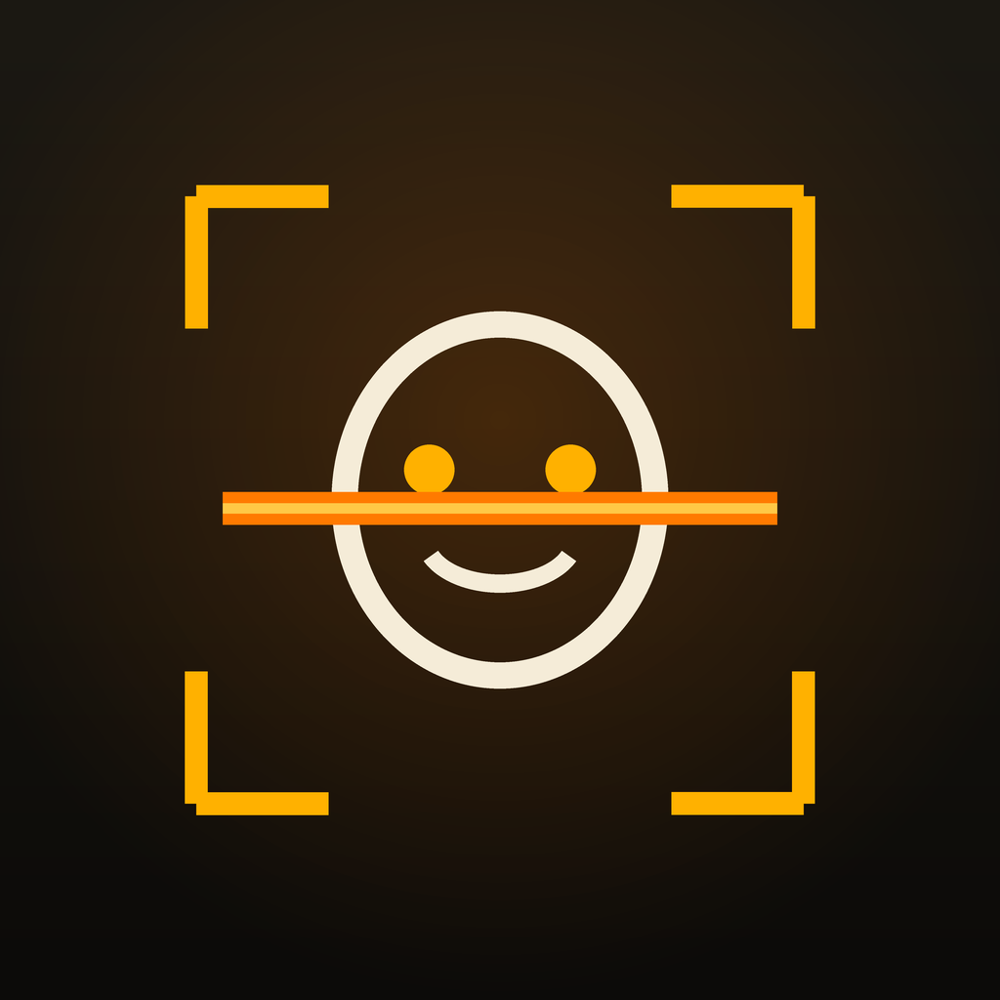
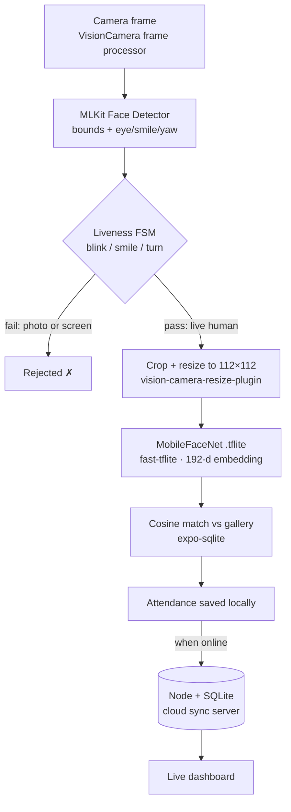
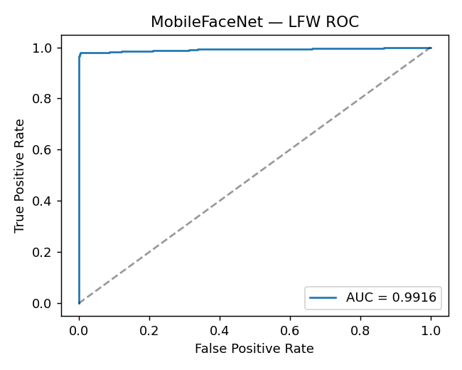
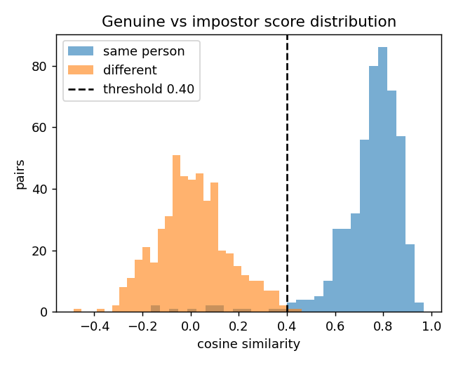
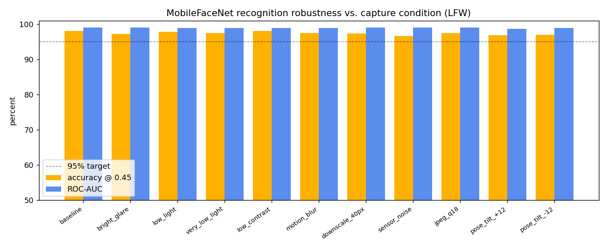

<div align="center">



# 🛡️ Offline Facial Recognition & Liveness Detection System

### Secure, on-device face authentication for remote zero-network locations

**NHAI Hackathon 2025** — *Develop a Secure Offline Facial Recognition & Liveness Detection System for Remote Locations*

[](#)
[](#)
[](#)
[](#)
[](#)
[](#)
[](#)

</div>

---

## The Challenge

Build an AI system that **recognizes faces offline**, **detects fake attendance** via liveness checks, runs on **mid-range phones (3 GB RAM)** in **zero-network locations**, with **lightweight (~20 MB) models**, **>95% accuracy**, in **under 1 second** — and syncs to the cloud when a network returns.

## ✅ Every requirement, and how it's met

| Requirement | How we meet it | Evidence |
| --- | --- | --- |
| Recognize faces **offline** | On-device MobileFaceNet embeddings + local cosine match — zero network | runs in a VisionCamera frame processor |
| Detect **fake attendance** | Active liveness: random **blink / smile / head-turn** challenge–response | a photo/screen can't comply |
| **Lightweight** models | MobileFaceNet TFLite | **4.99 MB** (≪ 20 MB budget) |
| **> 95%** accuracy | MobileFaceNet (ArcFace), benchmarked on LFW | **98.3%** (98.7% best), ROC-AUC **0.9916** |
| Authenticate in **< 1 second** | detect → align → embed → match | **13 ms** on laptop CPU (≈76× margin) |
| **Mid-range phones / 3 GB RAM** | TFLite + NNAPI/GPU delegate; ~5 MB resident | Hermes engine, old-arch RN |
| **Remote / no-network** | offline-first SQLite + sync queue | airplane-mode proof |
| **React Native**, Android & iOS | Expo (prebuild) app, native frame-processor pipeline | `mobile/` |
| **Offline → cloud sync + purge** | idempotent queue flush when online; cloud-confirmed records auto-purged (30 d) to bound storage | `server/` + live dashboard |
| **No duplicate identities** | enrol blocks an already-registered **face or name** (cosine dup-threshold + case-insensitive name check) | `mobile/app/(tabs)/enroll.tsx` |

> Accuracy, latency and model-size numbers are **measured** by `poc/benchmark.py` on the standard LFW
> verification protocol and saved to [`docs/benchmarks/metrics.json`](docs/benchmarks/metrics.json) — not estimated.

## Architecture



All boxes from *frame* to *attendance saved* run **on the phone, offline**. Only the final hop needs a network — and it's queued, so it happens whenever connectivity returns.

## Benchmark results (measured)

<div align="center">


</div>

| Metric | Result | Target |
| --- | --- | --- |
| Verification accuracy (LFW, 1000 pairs) | **98.7%** best · **98.3%** @0.45 | > 95% |
| ROC-AUC | **0.9916** | — |
| Face-detection rate | **99.85%** | — |
| Recognition latency (CPU) | **13.2 ms** (detect 8 + embed 4.7) | < 1000 ms |
| Model size | **4.99 MB** | ~20 MB |

Reproduce: `cd poc && python benchmark.py --pairs 1000`.

> **Model size vs app size:** the *AI model* is **4.99 MB** — the "lightweight (~20 MB)" target, beaten ~4×. The Android **APK is ~37 MB**: the whole app bundle (RN runtime + MLKit + TFLite native libraries for arm64 + the model).

> **Int8 compression (POC):** post-training int8 quantization of the same weights yields a **1.76 MB** model (2.85× smaller, ~11× under budget) at **97.8%** LFW (−0.5 pp, AUC 0.99) — [`docs/benchmarks/quantization.md`](docs/benchmarks/quantization.md). The verified float model remains the shipping artifact.

### Robustness across capture conditions

Remote sites mean bad light, cheap cameras and off-axis glances, so we stress-test the recogniser by degrading the **live probe** (clean enrolled template vs. degraded scan) across 11 realistic conditions — glare, low / very-low light, low contrast, motion blur, downscaling, sensor noise, JPEG compression, and ±12° pose tilt. Accuracy stays **≥ 96.7%** (≥ 98.6% of clean) and **ROC-AUC ≥ 0.987** on every one.

<div align="center">

</div>

Full table, protocol and caveats: [`docs/benchmarks/conditions.md`](docs/benchmarks/conditions.md). Reproduce: `cd poc && python eval_conditions.py --pairs 600`.

## The three components

| Folder | What it is | Run |
| --- | --- | --- |
| [`mobile/`](mobile/) | **Expo React Native app** — the on-device product (Android & iOS) | `cd mobile && npm i && npx expo run:android` |
| [`poc/`](poc/) | **Python reference** — same model, runnable proof + benchmark + webcam demo | `cd poc && pip install -r requirements.txt && python benchmark.py` |
| [`server/`](server/) | **Node + SQLite** offline→cloud sync backend + live dashboard | `cd server && npm i && npm start` |

Each component has its own README with detailed setup. See [`mobile/README.md`](mobile/README.md) for the device runbook.

## How the anti-spoofing works

The most common attendance fraud is holding up a **photo** or **video** of someone else. We defeat it with **active liveness**: before recognition, the app issues a **randomly chosen** challenge —

> *"Please blink"* · *"Please smile"* · *"Turn your head"*

— and verifies completion from MLKit's `leftEyeOpenProbability`, `smilingProbability`, and head-yaw signals. A static photo can't blink on demand, a pre-recorded video won't match the *random* prompt, and only a real, present human passes. Recognition only runs **after** liveness passes.

We also **demonstrate a passive, texture-based anti-spoof** model as an optional second layer: on **LCC-FASD** it catches **93.5%** of print/replay attacks (ROC-AUC **0.85**). It's threshold-sensitive across cameras, so it's a tunable add-on *behind* the primary active defense — details + honest caveats in [`docs/benchmarks/antispoofing.md`](docs/benchmarks/antispoofing.md).

## Tech stack

**Mobile:** Expo SDK 52 · React Native 0.76 · `react-native-vision-camera` 4.7 · `react-native-fast-tflite` 1.6 · `vision-camera-resize-plugin` · `react-native-vision-camera-face-detector` (MLKit) · `expo-sqlite` · `expo-router`.
**Model:** MobileFaceNet (ArcFace loss), 112×112×3 → 192-d, TFLite.
**POC:** Python · MediaPipe Tasks FaceLandmarker · OpenCV · LiteRT (TFLite) · scikit-learn.
**Server:** Node · Express · better-sqlite3.

## Repository structure

```
mobile/   Expo RN app   — app/(tabs) screens + src/{camera,liveness,ml,db,sync,theme}
poc/      Python ref     — pipeline/ + benchmark.py + recognize.py (webcam demos)
server/   Sync backend   — Express + SQLite + live dashboard
docs/     architecture · integration · demo script · benchmarks (metrics + plots)
```

## Validation status

- ✅ **Running on a real device** — confirmed end-to-end on a **Samsung Galaxy S24 Ultra**: enrolment, **blink / smile / head-turn liveness**, the on-device recognition pipeline (with a live millisecond latency badge), and offline→cloud sync all run. Recognition **accuracy** is benchmarked in the POC (**98.3% LFW**); on-device recognition is a functional 2D prototype — see [`docs/benchmarks/ondevice-recognition.md`](docs/benchmarks/ondevice-recognition.md). Install the prebuilt APK or build via the [runbook](mobile/README.md).
- ✅ **POC** — runs and is benchmarked end-to-end (the numbers above are from this machine).
- ✅ **Server** — verified end-to-end (health, auth, idempotent sync, dashboard).
- ✅ **Mobile** — `tsc` clean · `expo-doctor` 18/18 · ships an **arm64 release APK (~37 MB)** — the AI model inside it is **4.99 MB**.

See **[SUBMISSION.md](SUBMISSION.md)** for the mapping to the evaluation criteria and **[docs/integration.md](docs/integration.md)** for dropping the pipeline into an existing RN app.

---

<div align="center">
Built for the <b>NHAI Hackathon 2025</b> · Secure Offline Facial Recognition &amp; Liveness Detection.
</div>
