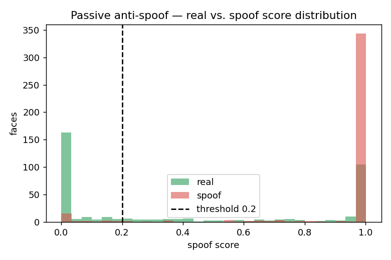

# Passive anti-spoofing — a second liveness layer

The app's primary defense against fake attendance is **active liveness**: a
randomly chosen blink / smile / head-turn challenge that a printed photo or a
pre-recorded replay cannot satisfy on demand. This experiment adds and evaluates
a **passive, texture-based** anti-spoof model as an optional **second layer** —
a model that looks at a single captured frame and judges whether the texture
looks like a live face vs. a print/screen recapture.

## Model

`FaceAntiSpoofing.tflite` (Deep-Tree anti-spoof, from
[syaringan357/Android-MobileFaceNet-MTCNN-FaceAntiSpoofing](https://github.com/syaringan357/Android-MobileFaceNet-MTCNN-FaceAntiSpoofing)),
**3.9 MB**, 256×256×3 RGB in [0,1] → two `[1,8]` heads (class predictions +
one-hot leaf-routing mask). Decision rule (matches the reference):

    spoof_score = Σ_i |pred_i| · mask_i ;   score > 0.2 ⇒ spoof, ≤ 0.2 ⇒ live

Wrapped in [`poc/pipeline/antispoof.py`](../../poc/pipeline/antispoof.py).

## Evaluation

We score **400 real + 400 spoof** face crops from **LCC-FASD** (Large
Crowd-collected Facial Anti-Spoofing Dataset; print + replay attacks), labelled
by its `CLIENT` (real) / `IMPOSTER` (spoof) lists.

| Operating point | Live-pass (real accepted) | Spoof-reject (attack caught) | Balanced acc |
| --- | --- | --- | --- |
| Reference threshold 0.20 | 49.5% | **93.5%** | 71.5% |
| Tuned threshold ~0.97 | **75.3%** | 85.3% | **80.3%** |

**ROC-AUC = 0.85** · mean score real **0.41** vs. spoof **0.90**.



## Interpretation (honest)

- The model carries a **genuine spoof signal** — real and spoof score
  distributions are well separated (AUC 0.85; means 0.41 vs 0.90), and at its
  default threshold it catches **93.5%** of print/replay attacks.
- But this is a **cross-dataset** test (the model was trained on a different
  capture distribution than LCC-FASD), so the reference threshold of 0.2
  **over-rejects real faces** (49.5% live-pass). Re-tuning the threshold to the
  deployment camera recovers a balanced **~80%** (75% live / 85% spoof).
- Conclusion: passive anti-spoofing is a useful **secondary** check but is
  **sensor/threshold-sensitive**, which is exactly why we keep the
  **active challenge–response** as the primary, sensor-agnostic, device-proven
  defense and treat this model as a tunable add-on.

## How it composes in the pipeline

After the active challenge passes, run the passive model on the captured crop and
reject if `spoof_score > threshold` (threshold calibrated per deployment camera).
The two layers are complementary: active liveness defeats static photos / wrong
replays; passive texture analysis adds resistance to a live-but-presented
photo/screen.

## Scope

POC demonstration. The model is **not enabled by default in the shipped app**
pending on-device + on-domain threshold calibration; the active liveness layer
remains the verified defense.

## Reproduce

```bash
# model: app/src/main/assets/FaceAntiSpoofing.tflite from the repo above -> poc/models/
# data:  kaggle dataset aleksandrpikul222/lcc-fasd (via kagglehub)
poc\.venv\Scripts\python.exe eval_antispoof.py --data <LCC-FASD root> --per-class 400
```
