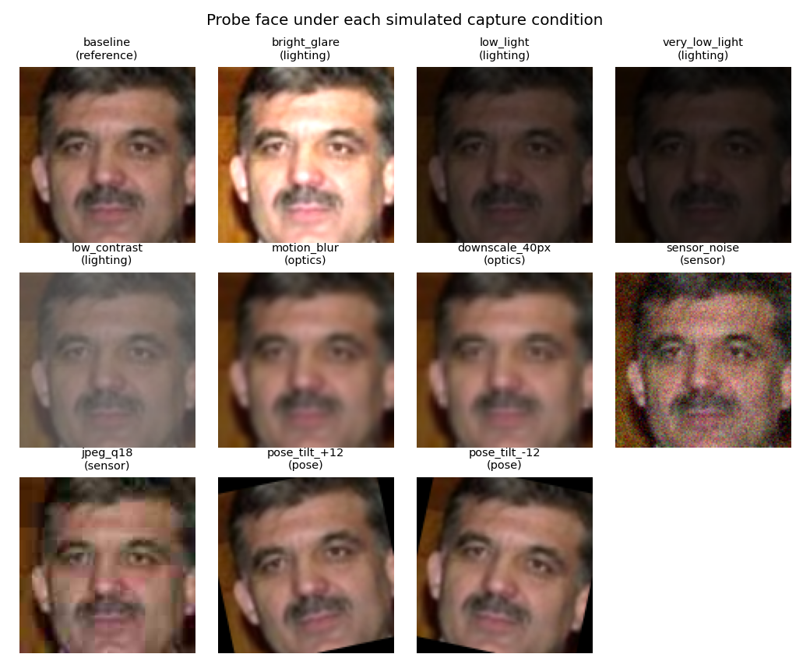

# Robustness across capture conditions (lighting / optics / pose)

Remote NHAI sites are not a photo studio: harsh midday glare, near-dark
gatehouses at night, dusty low-end cameras, and workers glancing at the device
off-axis. The headline 98.3% LFW number is measured on clean, funneled images,
so on its own it does **not** prove the system still works in those conditions.
This eval closes that gap empirically.

## Protocol

We reuse the LFW verification pairs (600, class-balanced) and the *same*
MobileFaceNet model the app ships. For each pair we detect + ArcFace-align both
faces, then:

- **image A** is kept clean — it stands in for the **enrolled template** (which
  is captured once, in good conditions);
- **image B** is the **live probe** — we apply a realistic degradation to its
  aligned 112×112 crop before embedding.

We then score cosine similarity and report, per condition, accuracy at the
deployed operating threshold (**0.45**), accuracy at that condition's own
optimal threshold, ROC-AUC, and accuracy **retention** vs. the clean baseline.

Degrading only the probe (not the template) is the realistic attendance case and
isolates the **recogniser's** robustness; face *detection* is measured
separately at **99.85%** on clean images (`metrics.json`).

## Conditions

| Group | Conditions (what they emulate) |
| --- | --- |
| lighting | `bright_glare` ×1.7 (overexposure) · `low_light` ×0.45 · `very_low_light` ×0.28 (night) · `low_contrast` (haze/backlight) |
| optics | `motion_blur` (7px Gaussian) · `downscale_40px` (distance / low-res sensor) |
| sensor | `sensor_noise` (σ=20 Gaussian) · `jpeg_q18` (aggressive compression) |
| pose | `pose_tilt_±12°` (off-axis glance / tilted device) |

## Results (LFW, 600 pairs, operating threshold 0.45)

| Condition | Group | Acc @0.45 | Acc (best) | ROC-AUC | Retention |
| --- | --- | --- | --- | --- | --- |
| baseline | reference | 98.0% | 98.3% | 0.9900 | 100.0% |
| bright_glare | lighting | 97.2% | 97.8% | 0.9896 | 99.2% |
| low_light | lighting | 97.8% | 98.5% | 0.9890 | 99.8% |
| very_low_light | lighting | 97.5% | 98.5% | 0.9887 | 99.5% |
| low_contrast | lighting | 98.0% | 98.5% | 0.9892 | 100.0% |
| motion_blur | optics | 97.5% | 98.3% | 0.9895 | 99.5% |
| downscale_40px | optics | 97.3% | 97.8% | 0.9896 | 99.3% |
| sensor_noise | sensor | 96.7% | 97.8% | 0.9900 | 98.6% |
| jpeg_q18 | sensor | 97.5% | 97.8% | 0.9901 | 99.5% |
| pose_tilt_+12 | pose | 96.8% | 97.2% | 0.9871 | 98.8% |
| pose_tilt_-12 | pose | 97.0% | 97.3% | 0.9893 | 99.0% |

**Takeaway:** across every simulated condition the recogniser stays **≥ 96.7%**
accuracy (≥ 98.6% of clean) and **ROC-AUC ≥ 0.987** — comfortably above the 95%
bar. The hardest cases are sensor noise and off-axis pose, exactly as expected;
lighting changes are absorbed almost entirely by the model plus the in-app
**tunable threshold** (Config), which lets an operator trade FAR/FRR per site.

## Honest caveats

- Conditions are **synthetic** augmentations of LFW, not field captures; they
  bound the *recogniser's* sensitivity, not end-to-end detection in the dark.
- **LFW has a known demographic skew.** These numbers show robustness to
  lighting/optics/pose; broad demographic generalisation would need a balanced
  field dataset and is the right next validation step before scale-out.

Reproduce: `cd poc && python eval_conditions.py --pairs 600`
(writes `conditions.json`, `conditions.png`, `condition_montage.png`).
